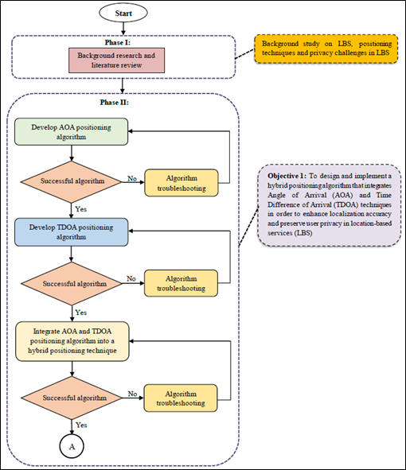
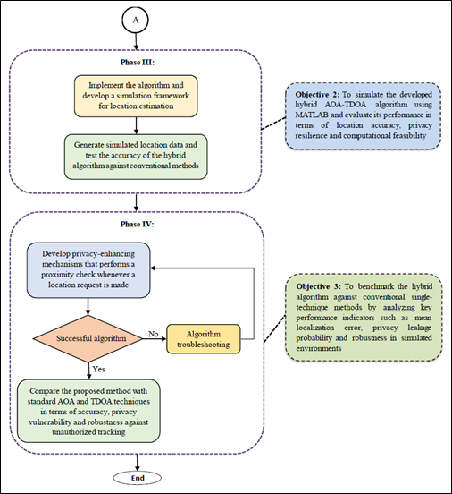
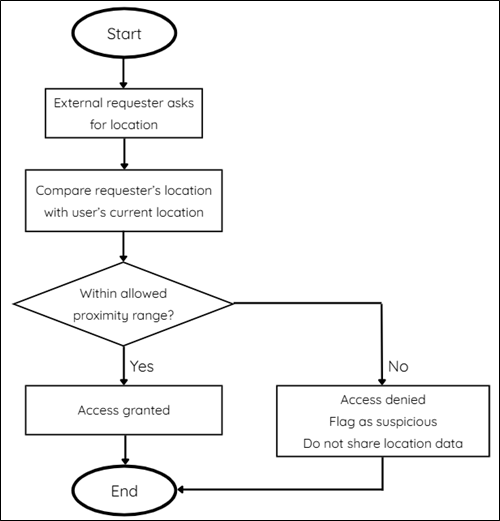

### Final Year Project | iNOTEK Series I 2026 Silver Award
## Enhancing Privacy in Location-Based Services Using a Hybrid AOA-TDOA Positioning Technique 

This project develops a privacy-aware localization framework for Location-Based Services by combining Angle of Arrival and Time Difference of Arrival methods. The hybrid algorithm was implemented in MATLAB to improve positioning accuracy while reducing the exposure of precise user location data.

---

## Problem

Conventional Location-Based Services often require users to share precise location data with service providers, which may expose sensitive personal information. This project investigates how localization techniques can be designed to maintain accurate positioning while protecting user privacy.

- Current positioning methods (GPS, Wi-Fi, Cellular) tend to expose user locations to third parties
- Privacy Risks: User location exposure, unauthorized tracking, misuse of data
- Motivation: Need for accurate positioning without compromising privacy

---

## Proposed Solution

- A hybrid localization algorithm combining AOA and TDOA was developed to estimate user location more accurately.
- A proximity-based access control mechanism was designed to limit the disclosure of precise location information to unauthorized parties.

---

## System Architecture

The system architecture outlines the workflow for developing a hybrid AOA–TDOA localization framework. Standalone AOA and TDOA algorithms are first developed and validated before being integrated into a hybrid positioning algorithm implemented in MATLAB. The system then evaluates localization performance using simulated data and incorporates a proximity-based mechanism to enhance user privacy.

### Project Overall Flowchart

The flowchart illustrates the process of collecting AOA and TDOA measurements from multiple anchor nodes, followed by position estimation through the hybrid localization algorithm. The algorithm combines angular and time-difference information to improve localization accuracy compared to single-technique methods.

  
  

### Proximity-Based Privacy Mechanism

To enhance user privacy, a proximity-based access control mechanism is introduced. Only users within a predefined proximity radius are allowed to obtain more precise location information, while others receive limited or obfuscated location data.

  

The localization algorithm was implemented and simulated in MATLAB. Multiple anchor nodes were modeled to estimate target position using AOA and TDOA measurements. Performance was evaluated using statistical metrics including RMSE and CDF.

  
  
  

  Figure 1: Angle of Arrival (AOA) | Figure 2: Time Difference of Arrival (TDOA) | Figure 3: Hybrid Localization (AOA & TDOA)

---

## Results

Simulation results demonstrate that the hybrid AOA–TDOA framework improves localization accuracy compared to single-technique approaches. Performance evaluation using RMSE and cumulative distribution functions shows more reliable positioning while maintaining user privacy constraints.

### Angle of Arrival (AOA)

  
  

  Figure 4: Angle of Arrival (AOA) with Non-Line-Of-Sight (NLOS) errors injected

### Time Difference of Arrival (TDOA)

  
  

  Figure 5: Time Difference of Arrival (TDOA) with Non-Line-Of-Sight (NLOS) errors injected

### Hybrid Localization Approach (AOA + TDOA)

  
  

  Figure 6: Hybrid Localization Method with Non-Line-Of-Sight (NLOS) errors injected

### Root Mean Square Error (RMSE) & Cumulative Distribution Function (CDF) Analysis

  
  
  

  Average RMSE VS Number of Base Stations for

  Figure 7: AOA | Figure 8: TDOA | Figure 9: Hybrid

  
  
  

  Tabulation of Average RMSE with different number of base stations for

  Table 1: AOA | Table 2: TDOA | Table 3: Hybrid

  - Each curve increases from 0 to 1, implying the cumulative probability of RMSE values where a left-shifted curve represents better localization accuracy and a steeper slope represents more consistent performance. 

  

  Figure 10: CDF of RMSE for hybrid AOA & TDOA localization

### Proximity Check Analysis for Privacy Enhancement

When the input coordinates of the request is out of predefined acceptable range, it will be flagged as suspicious and the access is denied. This simulates that unauthorized or distance devices are filtered out without exposing sensitive spatial information.

  

  Figure 11: Input Device Location Out of Predefined Range

When the input coordinates of the request is within the predefined acceptable range, it falls below the threshold. Then, the requesting device is granted access with no exact position revealed to third party.

  

  Figure 12: Input Device Location within Predefined Range

These multiple randomized location requests were generated to simulate malicious requests from unauthorized third parties or hackers around the world. It can be observed that most randomly generated requests (99%) fall outside the proximity boundary. The system successfully identifies requests as accepted or denied based solely on proximity. 

  

  Figure 13: Fake Request Simulations

---

## Key Skills Demonstrated

- Wireless localization algorithms
- MATLAB simulation and modeling
- Data analysis using RMSE and CDF metrics
- Privacy-aware system design

## Technologies Used

- MATLAB
- Localization Algorithms
- AOA and TDOA Positioning
- Wireless Network Simulation
