### Integrated Design Project | iNOTEK Series I 2025 Silver Award
## Automated Water Quality Monitoring System for Pipelines

This project develops a sensor-based monitoring system for water pipelines to measure pH, turbidity, and temperature in real time. The data is processed by a microcontroller and displayed through an LCD interface with LED indicators for immediate monitoring. System testing in a simulated pipeline environment verified the functionality and reliability of the monitoring system.

---

## Problem
- Water quality may deteriorate during distribution due to pipe corrosion, leaks, or contamination.
- Traditional monitoring relies on periodic sampling that lacks real-time visibility.
- This project addresses the need for a real-time monitoring system to continuously track water quality parameters in distribution pipelines.

---

## Proposed Solution

- Developed a sensor-based monitoring system that measures key water quality parameters, including pH, turbidity, and temperature in distribution pipelines
- Implemented real-time monitoring through an LCD display and LED indicators to provide immediate feedback and enable early detection of potential water quality issues

---

### Project Overall Flowchart

The project began with literature review and system planning to determine suitable hardware components and monitoring parameters. An ESP32-based system was then designed to integrate pH, turbidity, and temperature sensors, followed by circuit construction, coding in Arduino IDE, and system testing. After successful validation, the prototype and PCB design were developed and the project was documented with performance evaluation and analysis.

  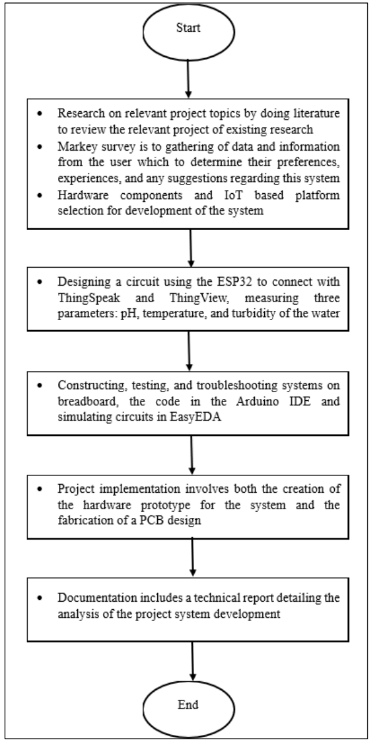

---

## Implementation
### Software
- Sensor Integration using Arduino IDE
- PCB Design using EasyEDA

  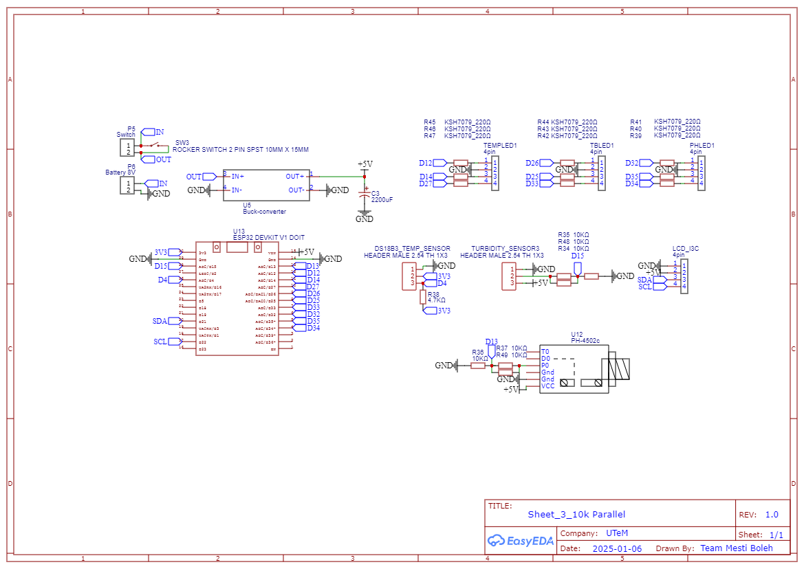
  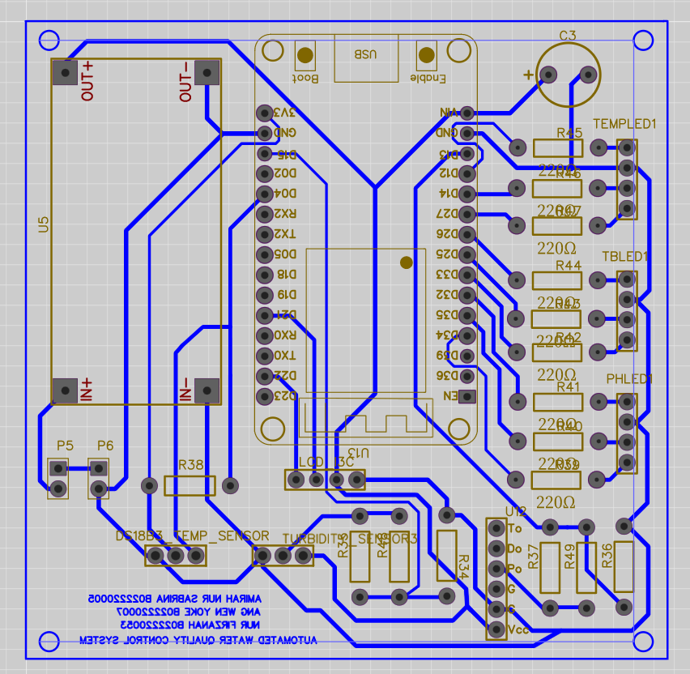

### Hardware
- Enclosure Design
- PCB Fabrication
- PCB Soldering and Testing
  

  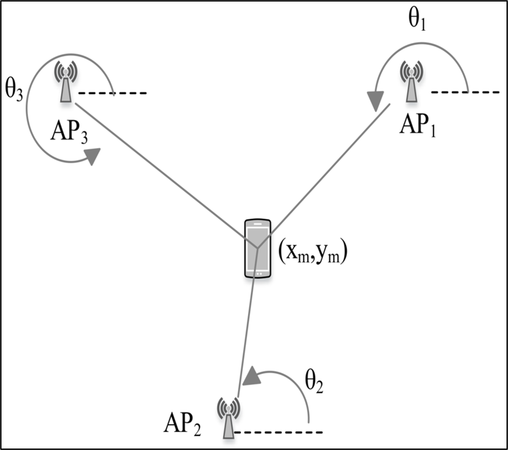
  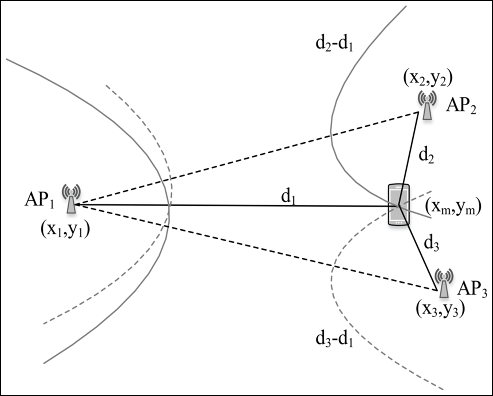
  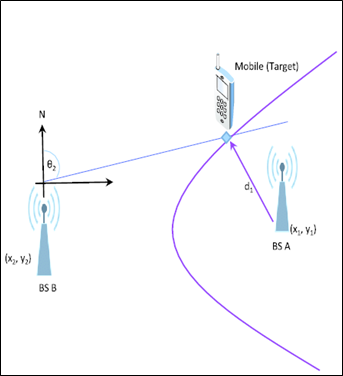

  Figure 1: Angle of Arrival (AOA) | Figure 2: Time Difference of Arrival (TDOA) | Figure 3: Hybrid Localization (AOA & TDOA)

---

## Results

Simulation results demonstrate that the hybrid AOA–TDOA framework improves localization accuracy compared to single-technique approaches. Performance evaluation using RMSE and cumulative distribution functions shows more reliable positioning while maintaining user privacy constraints.

### Angle of Arrival (AOA)

  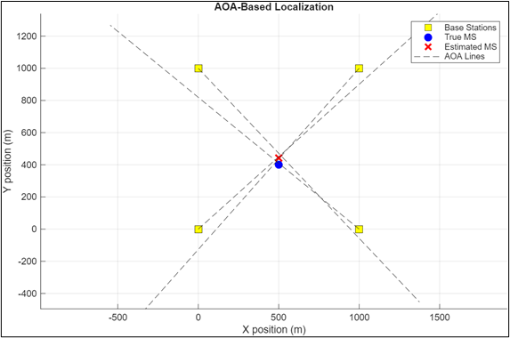
  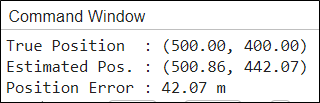

  Figure 4: Angle of Arrival (AOA) with Non-Line-Of-Sight (NLOS) errors injected

### Time Difference of Arrival (TDOA)

  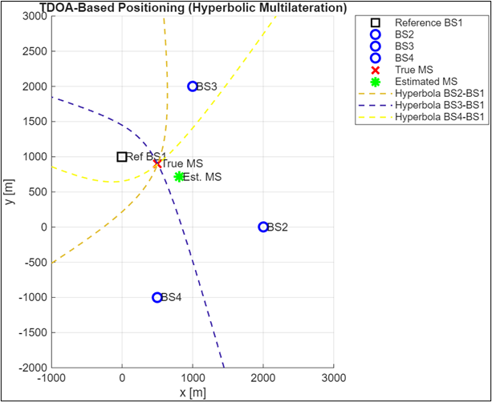
  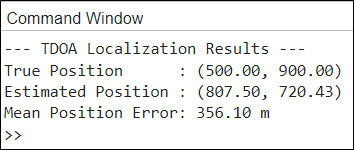

  Figure 5: Time Difference of Arrival (TDOA) with Non-Line-Of-Sight (NLOS) errors injected

### Hybrid Localization Approach (AOA + TDOA)

  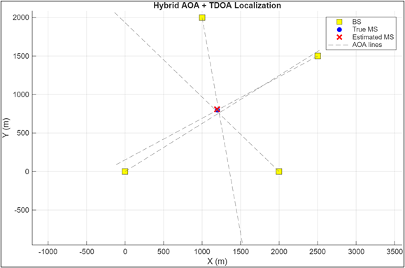
  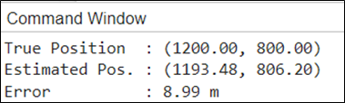

  Figure 6: Hybrid Localization Method with Non-Line-Of-Sight (NLOS) errors injected

### Root Mean Square Error (RMSE) & Cumulative Distribution Function (CDF) Analysis

  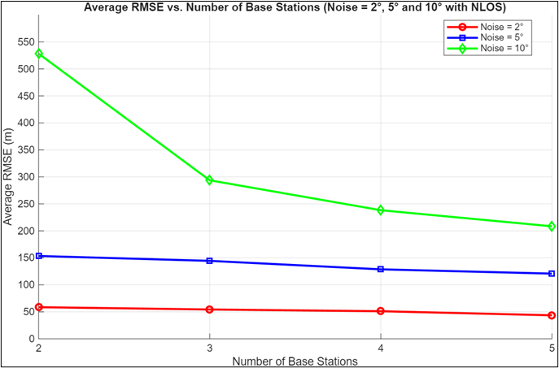
  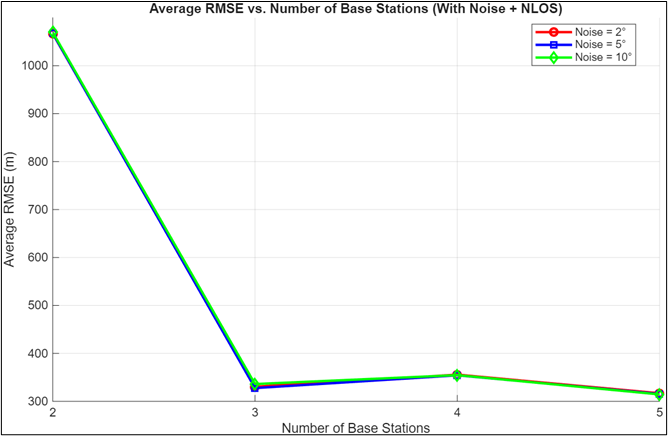
  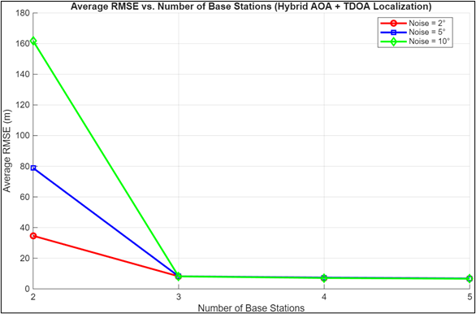

  Average RMSE VS Number of Base Stations for

  Figure 7: AOA | Figure 8: TDOA | Figure 9: Hybrid

  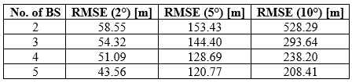
  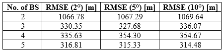
  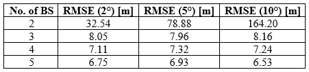

  Tabulation of Average RMSE with different number of base stations for

  Table 1: AOA | Table 2: TDOA | Table 3: Hybrid

  - Each curve increases from 0 to 1, implying the cumulative probability of RMSE values where a left-shifted curve represents better localization accuracy and a steeper slope represents more consistent performance. 

  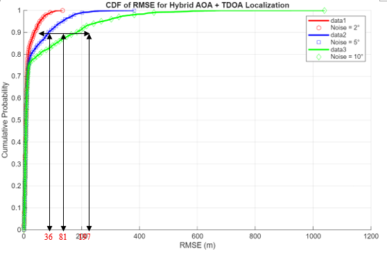

  Figure 10: CDF of RMSE for hybrid AOA & TDOA localization

### Proximity Check Analysis for Privacy Enhancement

When the input coordinates of the request is out of predefined acceptable range, it will be flagged as suspicious and the access is denied. This simulates that unauthorized or distance devices are filtered out without exposing sensitive spatial information.

  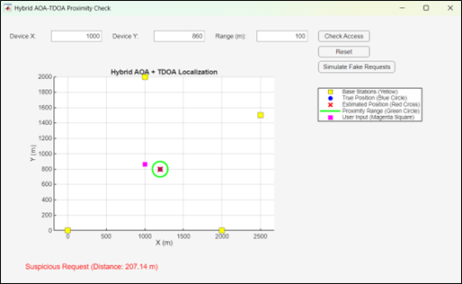

  Figure 11: Input Device Location Out of Predefined Range

When the input coordinates of the request is within the predefined acceptable range, it falls below the threshold. Then, the requesting device is granted access with no exact position revealed to third party.

  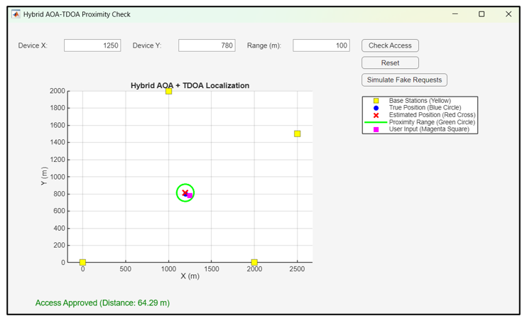

  Figure 12: Input Device Location within Predefined Range

These multiple randomized location requests were generated to simulate malicious requests from unauthorized third parties or hackers around the world. It can be observed that most randomly generated requests (99%) fall outside the proximity boundary. The system successfully identifies requests as accepted or denied based solely on proximity. 

  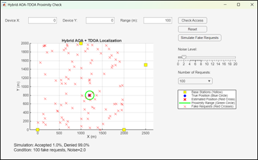

  Figure 13: Fake Request Simulations

---

## Key Skills Demonstrated

- Wireless localization algorithms
- MATLAB simulation and modeling
- Data analysis using RMSE and CDF metrics
- Privacy-aware system design

## Technologies Used

- MATLAB
- Localization Algorithms
- AOA and TDOA Positioning
- Wireless Network Simulation
