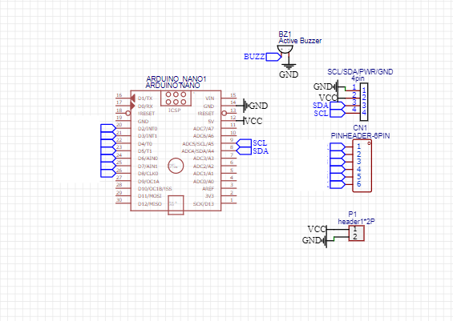
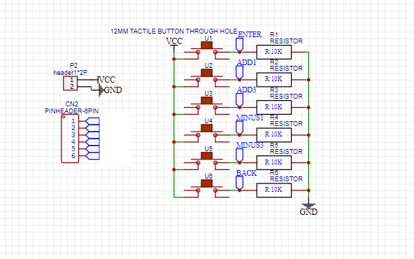
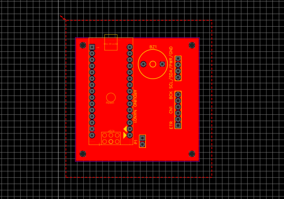
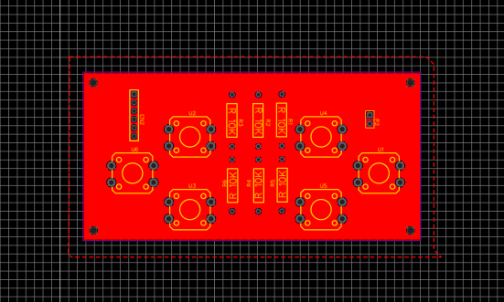
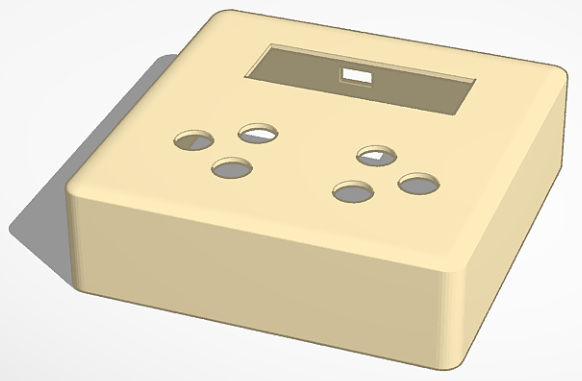
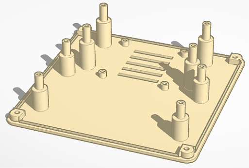
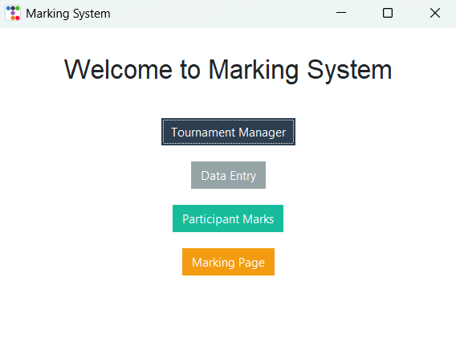
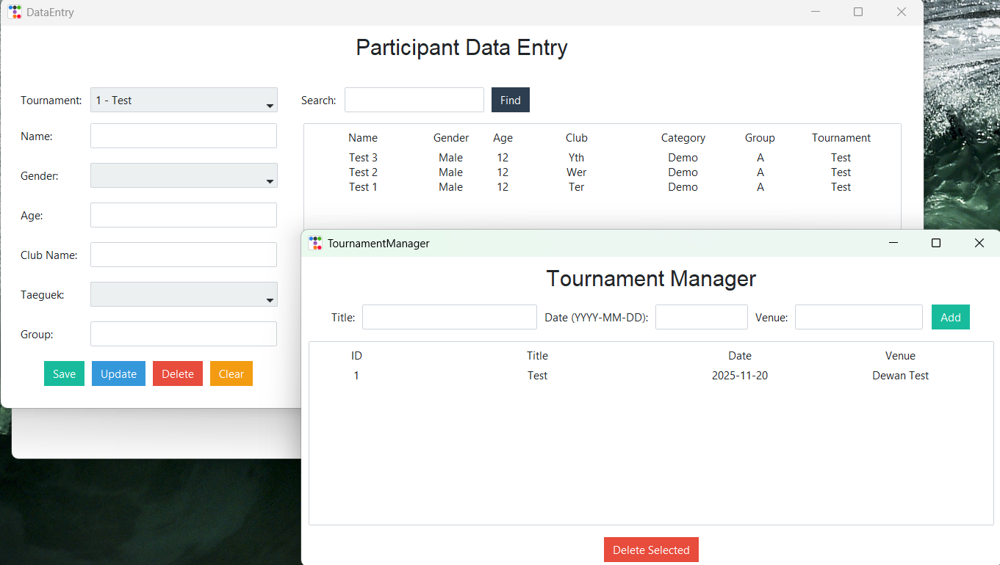
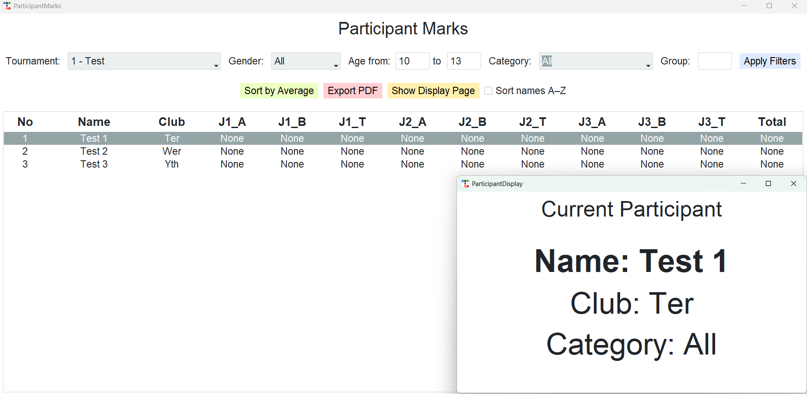
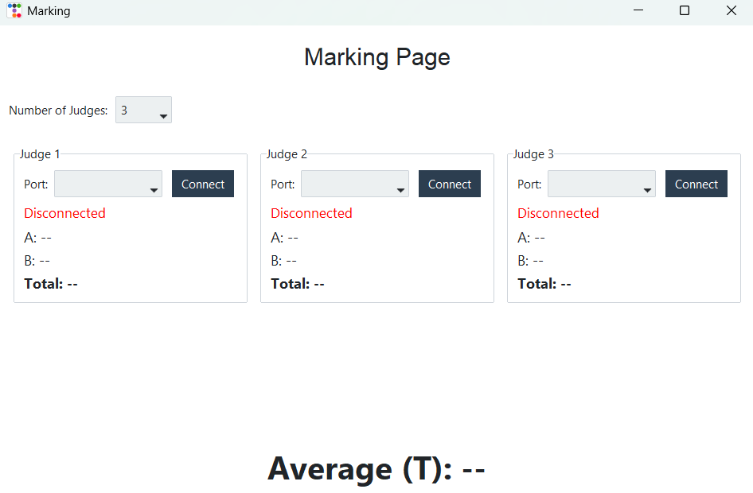

### Taekwondo Poomsae Scoring System
 

A real-time Taekwondo poomsae scoring system that captures judges’ inputs via hardware devices and processes them in a Python-based application to compute accurate final scores and display results.

---

## Problem

Manual scoring in poomsae competitions is susceptible to human errors such as miscalculation, inconsistent judging, and incorrect recording of scores. Additionally, the process is often slow and lacks transparency, making it difficult to track scoring history and ensure fairness in real time.

---

## Proposed Solution

- A low-cost automated scoring system is developed using microcontrollers to capture judges’ inputs and transmit them to a central application in real time. 
- A Python-based GUI processes the incoming data, applies scoring logic (including additions, deductions and averaging), and provides instant and transparent result visualization.

---

## System Architecture

The system is designed with multiple microcontroller-based input units assigned to each judge, which communicate with a central computer via serial (UART) connections. The central Python application acts as the processing hub, handling data synchronization, score computation, and real-time display through a user-friendly interface.

---

## Implementation
# Hardware
- Built hardware input system using push buttons and microcontrollers (Arduino Nano)
- Design PCB using EasyEDA and send for fabrication

  
  
  
  

- Design hardware enclosure using Tinkercad

  
  

# Software
- Established serial communication between devices and Python application
- Developed a multi-page GUI using Tkinter for data entry, scoring, and history tracking
- Implemented scoring logic including deductions, additions, and averaging across judges

  
  
  
  
  

  
---

## Results

The system successfully automated score calculation, reduced human error, and provided real-time visualization of scoring and history tracking during competitions.

---

## Key Skills Demonstrated

- Embedded systems integration
- Serial communication (hardware–software interface)
- GUI development in Python
- Real-time data processing
- System design and debugging

## Technologies Used

- Python (Tkinter, PySerial)
- Arduino Nano
- Serial Communication (UART)
- Basic electronics (push buttons, GPIO)
