### Auto Lighting System for Street Lights
 

This project implements a smart street lighting system that improves energy efficiency through automatic light detection and control. It features IoT-based monitoring by sending real-time data to a cloud dashboard for visualization and analysis.

---

## Problem

Traditional street lighting systems often rely on manual control or fixed timers, leading to unnecessary energy consumption and inefficiency. These systems also lack real-time monitoring, making maintenance and performance tracking difficult.

---

## Proposed Solution

This project proposes an automated street lighting system that adjusts lighting based on ambient light intensity using an LDR sensor. It also integrates IoT capabilities to enable real-time monitoring and data visualization through a cloud platform.

---

## System Architecture

The system consists of an LDR sensor connected to the STM32F446RE, which processes light intensity data and controls the lighting output. An ESP8266 ESP-01 is used to transmit data to the ThingSpeak for remote monitoring and analysis.

  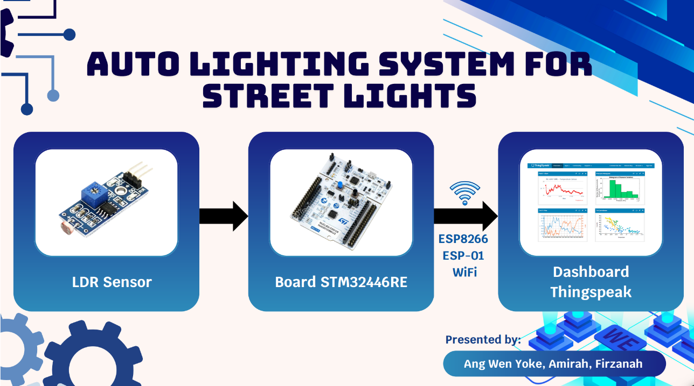

---

## Implementation
### Hardware

The LDR sensor is connected to an ADC pin of the STM32F446RE, utilizing its 12-bit ADC to convert analog light intensity into digital values. LEDs are driven through GPIO pins to simulate street lighting, while the ESP8266 ESP-01 communicates with the microcontroller via UART (e.g., 115200 baud rate) for wireless data transmission.

  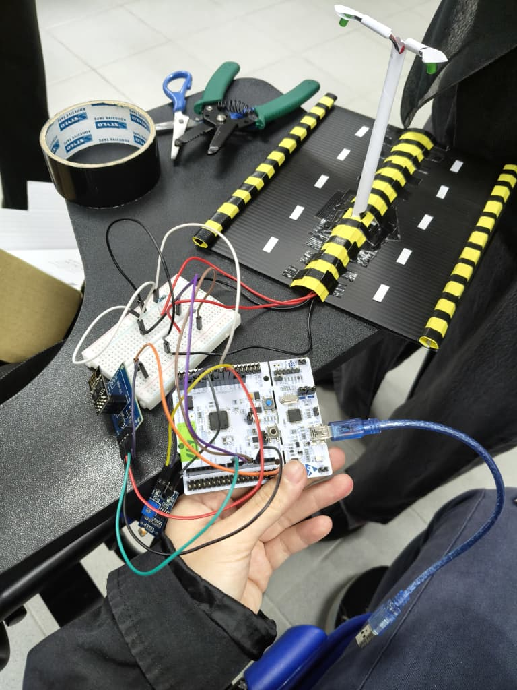

### Software

Embedded C firmware is developed in STM32CubeIDE to continuously sample ADC data, apply threshold-based decision logic, and control the lighting states. UART communication is configured to send formatted sensor data at regular intervals to the ThingSpeak, enabling real-time data logging and visualization.

  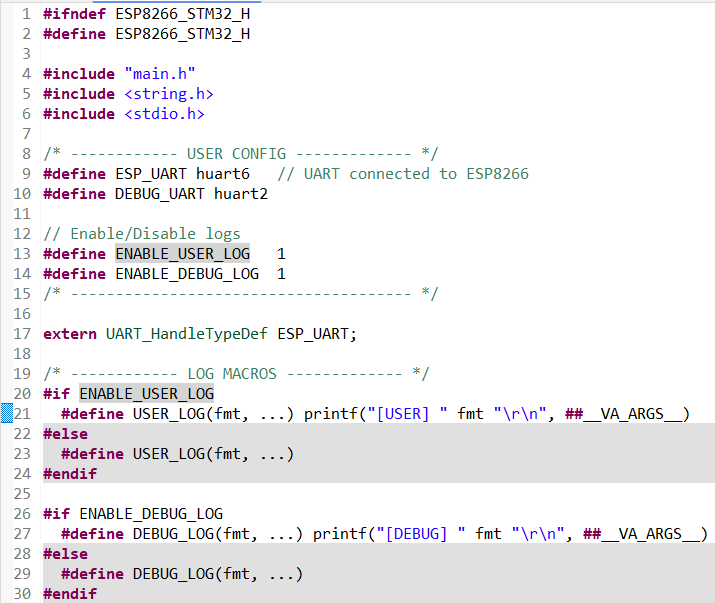
  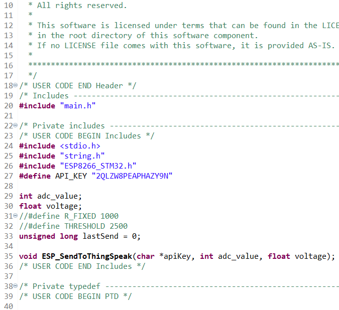
  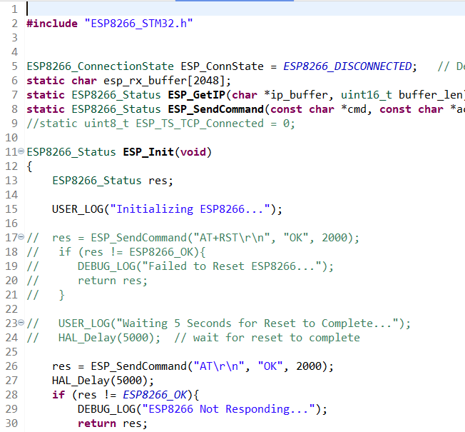
  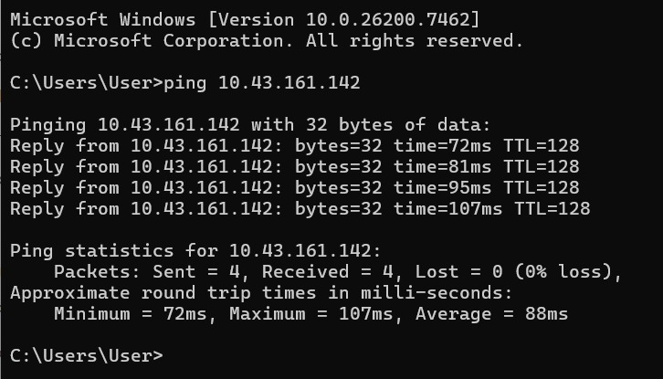
  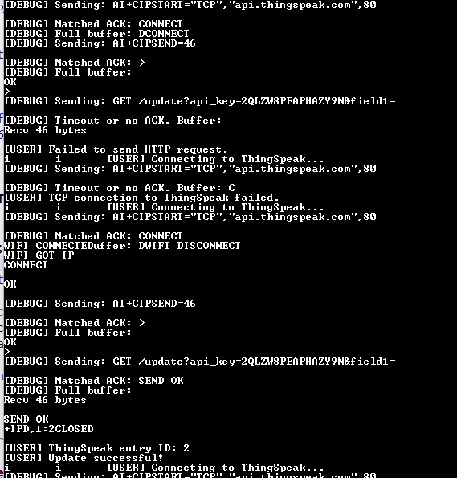
  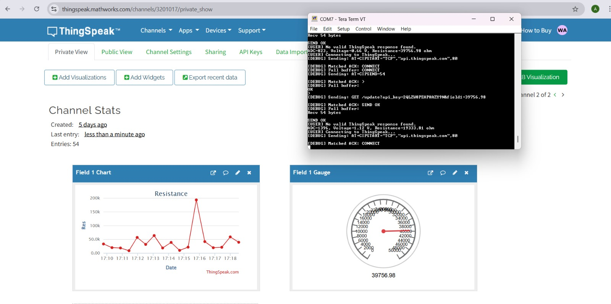
  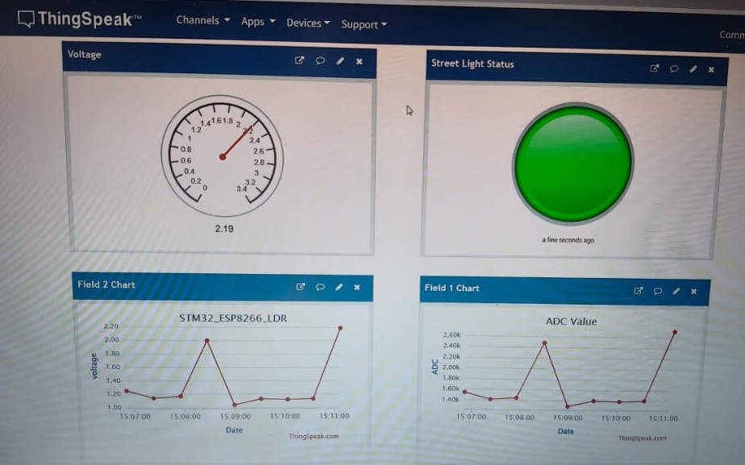

  
---

## Results

The system successfully automates street lighting control, turning lights on during low-light conditions and off during daylight. Real-time data visualization on the IoT dashboard demonstrates reliable system performance and remote accessibility.

  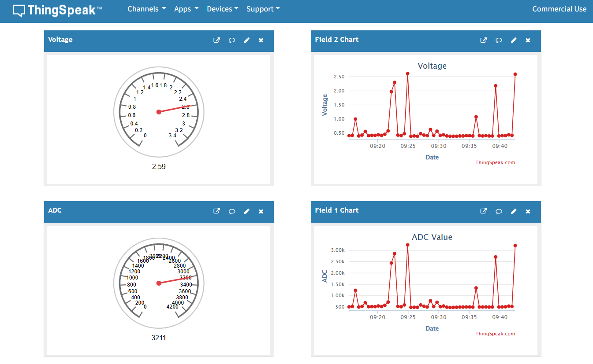
  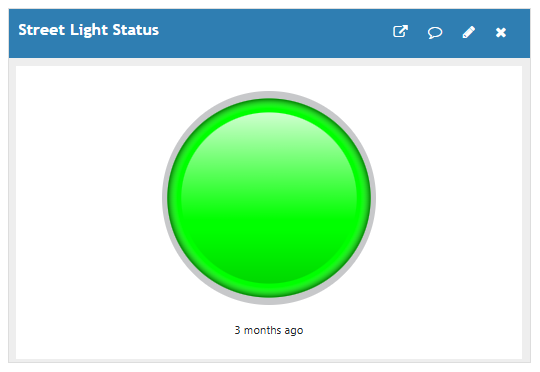
  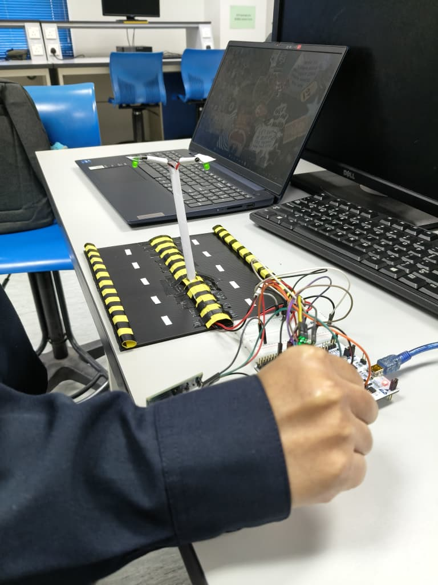

---

## Key Skills Demonstrated

- Embedded system design using STM32F446RE
- Microcontroller programming in Embedded C (ADC, GPIO, UART configuration)
- Sensor integration and analog signal processing (LDR with 12-bit ADC)
- IoT system integration with wireless communication using ESP8266 ESP-01
- Real-time data acquisition, formatting, and cloud transmission
- System debugging and testing using serial communication and live data monitoring
- Basic hardware prototyping and circuit integration

## Technologies Used

- Development Tools: STM32CubeIDE
- Programming Language: Embedded C
- Communication Protocols: UART (MCU ↔ ESP8266)
- IoT Platform: ThingSpeak
- Networking: Wi-Fi (via ESP8266 module)
